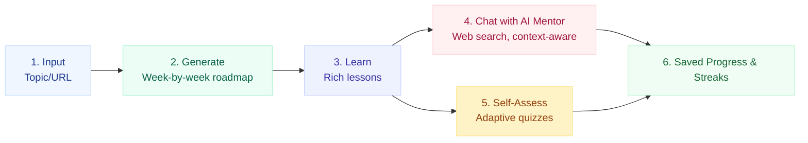
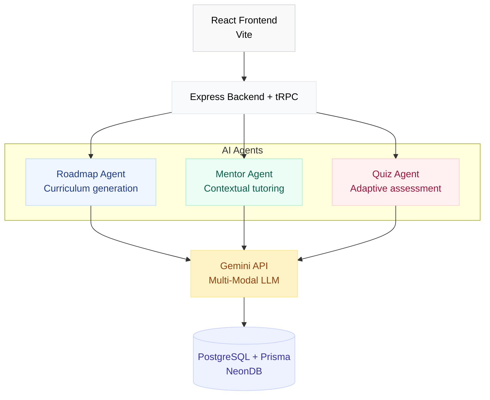

<div align="center">
  <h1>🎓 ZachCourse</h1>
  <p><b>AI-Powered Personalized Learning</b></p>
  <p>✨ <b>AGENTS FOR GOOD</b> ✨</p>
  <p>
    🔹 Dynamic Curricula | 🔹 Adaptive Quizzes | 🔹 24/7 AI Mentor | 🔹 Persistent Progress
  </p>
  <p>
    <code>GEMINI API</code> • <code>MULTI-AGENT</code> • <code>REACT + tRPC</code>
  </p>
  <a href="https://zachcourse-955328668699.asia-southeast1.run.app">
    
  </a>
  <a href="https://youtu.be/sBsXeVhbKHE">
    
  </a>
  <a href="https://www.kaggle.com/competitions/vibecoding-agents-capstone-project/writeups/zachcourse">
    
  </a>
  <a href="https://github.com/19akshansh/zachcourse/blob/main/LICENSE">
    
  </a>
</div>

<p align="center">
  <b>📖 Documentation:</b> <a href="SPEC.md">Technical Spec</a> • <a href="AGENTS.md">Agent Architecture</a> • <a href="IMPLEMENTATION.md">Implementation Notes</a>
</p>

## ✨ Core Features

| 🎓 Dynamic Curricula | 🤖 AI Mentor |
| :--- | :--- |
| • Paste URL, topic, or text<br/>• AI generates structured<br/>• week-by-week roadmap | • 24/7 conversational tutor<br/>• Web search + URL fetching<br/>• Persistent memory |

| ✅ Adaptive Quizzes | 📊 Persistent Progress |
| :--- | :--- |
| • Lesson-specific assessments<br/>• On-the-fly generation<br/>• Track understanding | • Save all courses & chats<br/>• Daily streaks & milestones<br/>• Resume anytime |

<div align="center">
  <br/>
  <blockquote>
    <b>Built with Advanced AI & Modern Tech</b><br/>
    Gemini API • React 19 • tRPC • Prisma PostgreSQL<br/>
    Multi-agent orchestration • Structured outputs • Agentic loops
  </blockquote>
</div>

<br/>

<p align="center">
  
</p>

<br/>

## 🔄 How It Works



## 🤖 The Agent System

ZachCourse is powered by a team of specialized AI agents working together:

- **Roadmap Agent:** Uses structured output generation to instantly design complete curriculums from messy inputs or simple topics.
- **Mentor Agent:** Operates in an agentic loop with custom tools (web search, URL fetching) to act as a highly contextual, interactive tutor.
- **Quiz Agent:** Generates lesson-specific, adaptive quizzes on demand to validate your understanding.
- **Progress Agent:** Maintains long-term memory, tracking your streaks, completed modules, and chat history across sessions.

## 🛠️ Tech Stack

| Category | Technology |
| :--- | :--- |
| **Frontend** | Vite, React 19, Tailwind CSS v4 |
| **Backend** | Express.js, tRPC v11 |
| **AI & Agents** | Vercel AI SDK v7, `@ai-sdk/google`, Gemini API |
| **Database & ORM** | NeonDB (PostgreSQL), Prisma |
| **Authentication** | Better Auth |

## 📁 Project Structure
---

```text
.
├── prisma/
│   ├── migrations/         # Database migrations
│   └── schema.prisma       # Prisma DB schema definition (Neon Postgres)
├── public/                 # Static assets and icons
├── scripts/
│   ├── eval-lessons.ts     # Offline Judge Agent evaluation suite
│   └── setup-db.sh         # Helper script for local DB setup
├── src/
│   ├── app/                # Main React web page wrappers & layout rules
│   │   ├── (auth)/         # Better Auth login/signup pages
│   │   ├── api/            # API pass-through rules
│   │   ├── layout.tsx      # Global view wrapper
│   │   └── page.tsx        # Base entry redirector
│   ├── components/         # Reusable frontend components
│   │   ├── tour/           # React Joyride tour onboarding modules
│   │   ├── PersonalizationFields.tsx # User experience & style personalization form
│   │   ├── AppHeader.tsx   # Header controls & user profile dropdown
│   │   ├── AppSidebar.tsx  # Dynamic course selection side menu
│   │   └── VisualRoadmapGraph.tsx  # Interactive @xyflow/react canvas
│   ├── features/
│   │   └── auth/           # Better Auth logic & social connectors
│   ├── lib/                # Core helper utilities
│   │   ├── tone-options.ts # Curated learning tones and instruction prompts
│   │   ├── resource-link.ts # Safe resource URL verification & domain blocklist
│   │   ├── SSRF-guard.ts   # Server-side request forgery safety rules
│   │   └── mentor-tools.ts # Search and link-fetching tool specifications
│   ├── server/             # tRPC database backend procedures & models
│   │   ├── agents/         # Centralized Multi-Agent content engines
│   │   │   └── roadmap-agent.ts # Roadmap & Visual Roadmap Agent definitions
│   │   └── trpc.ts         # tRPC root router and service procedure handlers
│   └── types/              # Shared TypeScript definition types
├── mcp_server.ts           # Standalone Model Context Protocol (MCP) tool server
├── server.ts               # Unified Express backend & Vite middleware server
└── package.json            # Application configuration & dependency tree
```

## 🚀 Getting Started

1. **Clone the repository:**
   ```bash
   git clone https://github.com/19akshansh/zachcourse.git
   cd zachcourse
   ```
2. **Install dependencies:**
   ```bash
   npm install
   ```
3. **Set up environment variables:**
   Create a `.env` file in the root directory and configure the variables listed in the section below.
4. **Run database migrations:**
   ```bash
   npx prisma migrate dev
   ```
5. **Start the development server:**
   ```bash
   npm run dev
   ```

## 🔑 Environment Variables

| Variable | Description | Required |
| :--- | :--- | :--- |
| `DATABASE_URL` | NeonDB connection string for Prisma | Yes |
| `DIRECT_URL` | Direct connection string for NeonDB | Yes |
| `BETTER_AUTH_SECRET` | Secret key for Better Auth sessions | Yes |
| `BETTER_AUTH_URL` | Base URL for auth (e.g., http://localhost:3000) | Yes |
| `APP_URL` | Application base URL | Yes |
| `VITE_APP_URL` | Application base URL for Vite client | Yes |
| `GITHUB_CLIENT_ID` | GitHub OAuth Client ID | No (for GitHub auth) |
| `GITHUB_CLIENT_SECRET` | GitHub OAuth Client Secret | No (for GitHub auth) |
| `DISCORD_CLIENT_ID` | Discord OAuth Client ID | No (for verified Discord social link) |
| `DISCORD_CLIENT_SECRET` | Discord OAuth Client Secret (redirect: `{BASE_URL}/api/auth/callback/discord`) | No (for verified Discord social link) |
| `GOOGLE_CLIENT_ID` | Google OAuth Client ID | No (for Google auth) |
| `GOOGLE_CLIENT_SECRET` | Google OAuth Client Secret | No (for Google auth) |
| `EMAIL_HOST` | SMTP host for email sending | No (for email magic links) |
| `EMAIL_PORT` | SMTP port | No |
| `EMAIL_USER` | SMTP user | No |
| `EMAIL_PASS` | SMTP password | No |
| `EMAIL_FROM` | Sender email address | No |
| `GEMINI_API_KEY` | Google Gemini API Key | Yes |

## 🏗️ Architecture



## 🧪 Evaluation

To ensure that generated educational material is technically accurate, clear, engaging, and maintains appropriate depth, ZachCourse includes an automated offline evaluation suite running the **Judge Agent**.

This evaluation runs completely independent of the PostgreSQL/Neon database. It analyzes hardcoded sample lessons (one high-quality and one intentionally flawed) against a strict educational rubric using Gemini and the Vercel AI SDK.

### Running the Evaluation & Unit Tests

To run the automated LLM-judge evaluation pipeline:

```bash
# Execute the automated Judge Agent evaluation pipeline
npm run eval
```

*The underlying command definition in `package.json` resolves to: `tsx scripts/eval-lessons.ts`*

To run the security and state layer unit tests:

```bash
# Run unit tests for SSRF-guard, document-processor, and memory chunking
npm run test
```

*This runs `vitest run` on cheap, pure, and critical security-relevant functions to guarantee robust logic.*

### Dual Execution Modes

To ensure a seamless experience for judges, the script supports two execution modes:
1. **Live AI Evaluation Mode:** When a valid `GEMINI_API_KEY` environment variable is defined, the evaluation pipeline calls `gemini-2.5-flash` in real time to generate object scores and critiques matching the production Judge Agent's prompt guidelines.
2. **Graceful Simulated Mode:** If `GEMINI_API_KEY` is not present, the script automatically alerts the console and prints pre-calculated, verified model outputs. This demonstrates the exact schema-compliant metrics and feedback that the Judge Agent returns in production without requiring configuration.

### What the Judge Agent Validates

When the evaluation is triggered, the Judge Agent will:
1. Parse lesson contents and matching concepts.
2. Score them out of 10 across four critical pedagogical metrics: **Clarity**, **Accuracy**, **Depth**, and **Engagement**.
3. Produce a consolidated, Zod-schema-validated overall rating and constructive list of issue findings.
4. Issue a final quality verdict: `PASS`, `NEEDS_REVISION`, or `FAIL`.

---

## 🏆 Built For

Created for the **Google x Kaggle 5-Day AI Agents Intensive Vibe Coding Capstone 2026** under the **Agents for Good (Education)** track.

## 📄 License

This project is licensed under the MIT License. See the [LICENSE](LICENSE) file for details.
